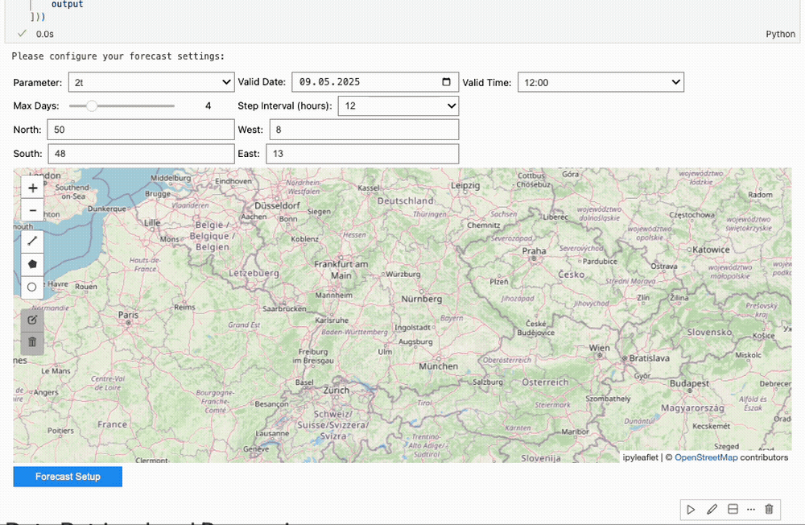
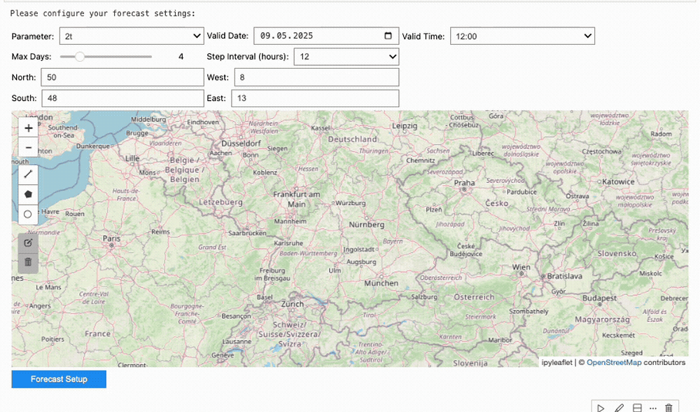

# diag_evo — Forecast Evolution Diagnostics

Interactive and static visualisation of forecast evolution ("Linus plot")
for multiple NWP and ML models.  Built on **MARS**, **earthkit-data**,
**Metview**, **ipywidgets** and **Plotly / Matplotlib**.

---

## Features

| Feature | Details |
|---------|---------|
| **Predefined models** | IFS Control, AIFS Single, AIFS ENS Control, IFS ENS, AIFS ENS, DE-LUMI, DE-ATOS |
| **Custom MARS models** | Add any model at runtime by specifying `class`, `type`, `stream`, `expver` and optional extra MARS keys |
| **Interactive plot** | Plotly box-plots with hover info (bias, lead time, member index) |
| **Static plot** | Matplotlib percentile boxes (1/10/25/50/75/90/99) with inset map |
| **Reference data** | Analysis, ERA5 climatology, observations |
| **Accumulated variables** | Automatic step differencing with configurable accumulation period |
| **Colour overrides** | Per-model colour control via `widgets_dict['config']['model_colors']` |
| **Export** | HTML (interactive) and PNG (static) |

---

## Area & Point Selection

The interactive map widget supports two selection modes:

### Area selection
Draw a polygon on the map to define a bounding box.



### Point selection
Click a single point on the map — the system creates a ±0.5° box around it and
reports the nearest observation station.



---

## Repository layout

```
diag_evo_v2/
├── diag_evo/                  # Python package
│   ├── __init__.py            # Public API
│   ├── core.py                # UI, retrieval and plotting logic
│   ├── settings.py            # Model & plot settings helpers
│   ├── variables.py           # Variable metadata & unit conversion
│   └── config/                # Default JSON configuration
│       ├── model_settings.json
│       ├── plot_settings.json
│       └── variable_settings.json
├── data_files/                # Auto-created at runtime (.gitignored)
├── forecast_evolution.ipynb   # Jupyter notebook to get you started
├── requirements.txt
├── .gitignore
└── README.md                  # ← you are here
```

---

## Installation

The package is designed to run on systems where **Metview** and
**earthkit-data** are already available (e.g. AtosmHPC).  
Clone the repository and install the remaining Python dependencies:

```bash
git clone <repo-url> diag_evo_v2
cd diag_evo_v2
pip install -r requirements.txt
```

---

## Quick start

```python
import sys, os
sys.path.insert(0, "/path/to/diag_evo_v2")

from diag_evo import (
    setup_interface,
    retrieve_and_store_data,
    plot_forecast_evolution,
    plot_forecast_evolution_static,
    setup_data_directories,
    get_area_string,
)

# 1. Launch the interactive widget UI
widgets_dict = setup_interface()

# 2. (Optional) override settings programmatically
# widgets_dict['config']['area_sub'] = [51.4, 5.7, 50.1, 9.4]
# widgets_dict['config']['point'] = [50.88, 7.01]

# 3. Retrieve data
base_path = "data_files"
plot_data = retrieve_and_store_data(widgets_dict, base_path)

# 4. Build output directories
area_str = get_area_string(widgets_dict['config']['area_sub'])
date_str = widgets_dict['config']['valid_date'].strftime("%Y%m%d")
_, _, plot_dir = setup_data_directories(base_path, widgets_dict['config']['param'], area_str, date_str)

# 5. Plot
plot_forecast_evolution(plot_data, widgets_dict, plot_dir, export_html=True)
plot_forecast_evolution_static(plot_data, widgets_dict, plot_dir, export_png=True)
```

See [`forecast_evolution.ipynb`](forecast_evolution.ipynb)
for a complete worked example.

---

## Adding custom models

### Via the UI

Use the **Custom MARS Model** panel on the right-hand side of the widget
interface.  Fill in `class`, `type`, `stream`, `expver`, tick
**Ensemble** if applicable, and click **Add Model**.

### Programmatically

```python
from diag_evo import register_custom_model

register_custom_model(
    name="My Experiment",
    retrieval_args={
        "class": "rd",
        "type": "fc",
        "stream": "oper",
        "expver": "xxxx",
    },
    is_ensemble=False,
    color="#ff6600",
)
```

---

## Colour overrides

Override plot colours for any model *before* calling the plot functions:

```python
widgets_dict['config']['model_colors'] = {
    'IFS Control': '#dd00ff',
    'AIFS ENS': '#2c32a0',
}
```

---

## Configuration files

| File | Purpose |
|------|---------|
| `diag_evo/config/model_settings.json` | MARS retrieval arguments per model |
| `diag_evo/config/plot_settings.json` | Marker styles, colours, layout |
| `diag_evo/config/variable_settings.json` | Variable metadata, units, conversion rules |

Edit these to add new predefined models or variables without touching
Python code.

---

## Dependencies

See [`requirements.txt`](requirements.txt).  Key dependencies:

- Python ≥ 3.9
- `metview` (system install)
- `earthkit-data`
- `ipywidgets`, `ipyleaflet`
- `plotly`, `matplotlib`, `cartopy`
- `numpy`, `pandas`

---

## License

Internal use — ECMWF.

## Contact
Do you want to report issues, suggest improvements or do you have any questions? Please contact [soufiane.karmouche@ecmwf.int](mailto:soufiane.karmouche@ecmwf.int)
